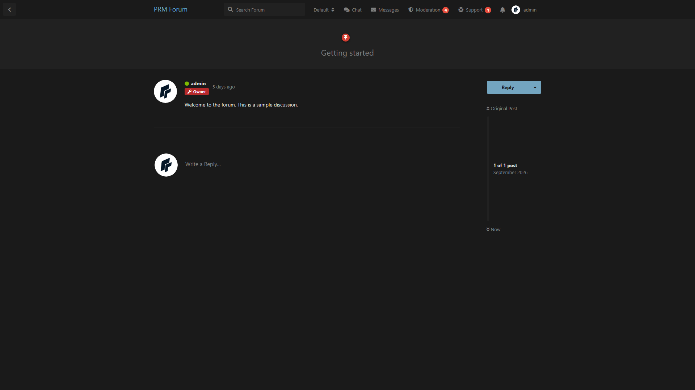
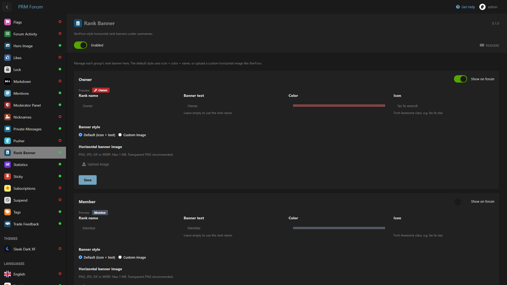

# Rank Banner

Horizontal rank banners under usernames, XenForo-style.

Compatible with **Flarum 1.8**.

## Screenshots

On a profile:


In a discussion:



Admin:



## What it does

- Shows a banner for each group under the username
- Default style: icon + color + label
- Optional **custom image** per group (horizontal PNG/JPG/GIF/WEBP, max 1 MB)
- Guest group is never shown as a banner
- Toggle **Show on forum** per group

## Install

```bash
composer config repositories.prm-rank-banner vcs https://github.com/smmpanelscripts1/prm-rank-banner
composer require prm/rank-banner:dev-main
```

Enable **Rank Banner**, then:

```bash
php flarum cache:clear
```

## How to use

1. Admin → **Rank Banner**
2. For each group, set name, color, Font Awesome icon, and banner text
3. Or switch to **Custom image** and upload a wide transparent PNG
4. Save each group

## License

MIT
